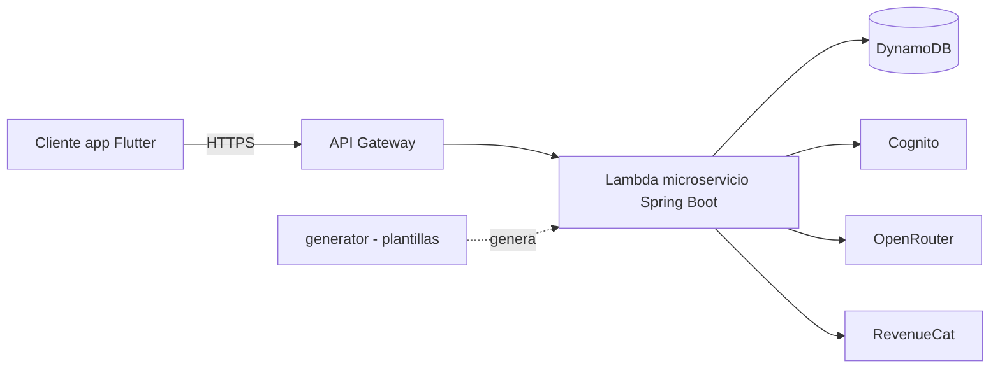
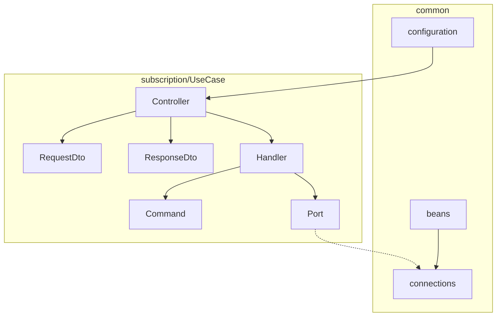
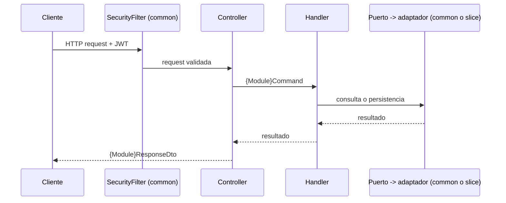

# Arquitectura

- Objetivo: `obj-004 Migrar backend generado de hexagonal horizontal a vertical slice`
- Agente: `Architect`
- Estado: `parcial`
- Resumen: `Backend generado por feature (vertical slice) con common transversal. ADR-0026`
  `aprobado por el usuario (2026-10-08); escritura en docs/adr bloqueada (permission.rejected).`
- Bloqueos:
  - `Escritura en docs/adr/0026-vertical-slice-backend.md rechazada (permission.rejected: edit),`
    `dos veces. Contenido del ADR en la sección ADR de este informe.`
  - `Revisión de Reviewer pendiente (no bloquea el registro de la decisión).`

## Entradas, requisitos y restricciones

- Fuentes leídas (solo lectura):
  - `AGENTS.md` del workspace.
  - `docs/deliverables/obj-004/obj-004.md`, `questions.md` (decisiones D1–D8).
  - `generator/components/backend/spring-boot-3.5.16/component.json`.
  - `templates/hexagonal-architecture-test.scriban`.
  - `docs/adr/0025-*.md` y `docs/adr/README.md`.
  - `docs/templates/deliverables/adr.md`.
- Requisitos (obj-004):
  - Estructura por feature: `{domain}/modules/{usecase}/{capa}` (original, obj-004).
  - Estructura por feature tras D87: `{domain}/{usecase}/{capa}`.
  - Clases: `{Module}Command` (record), `{Module}Handler`, `{Module}Controller`,
    `{Module}RequestDto`, `{Module}ResponseDto`.
  - `common`: conexiones, beans, `Configuration`, infraestructura reusable.
  - Sin SOAP si no se usa.
- Decisiones del usuario (2026-10-08):
  - Dominios: `subscription`, `ai`, `parameter`, `security`, `test`. Sin `quiz`.
  - `security`: auth, user, registration, password, admin-user, exchange.
  - `test`: sqs, sns, hola-mundo.
  - `subscription`: Subscription, RevenueCat, webhook, strategies, revenuecat-webhook-filter.
  - Puertos: siempre se crean, incluso de un solo uso.
  - `HexagonalArchitectureTest`: se adapta a vertical slice. `test.scriban` no se elimina.
  - `common`: `common/infrastructure/{configuration,beans,connections}`.
  - `update-all.ps1.scriban`: se corrige en este objetivo (placeholder y ruta relativa).
  - Implementación: `developer-scriban` (autorizado).
- Restricciones:
  - `generator` es fuente de verdad; solo templates y `component.json`.
  - Código fuente del generador sin cambios.
  - Sin migrar proyectos ya generados.
  - Coste 0 USD/mes.
- Hallazgos del generador:
  - Estructura actual horizontal: `application/`, `domain/`, `infrastructure/` por tipo.
  - Quiz no tiene plantillas propias; solo aparece como entidad en `target`.
  - Sin coincidencias de SOAP en `generator/`.
  - `hexagonal-architecture-test.scriban` impone capas hexagonales y ciclos entre slices
    `{{ PACKAGE }}.(*)..`.

## Diseño

- Componentes y responsabilidades:
  - `{{ PACKAGE }}.common.infrastructure/`: `configuration/`, `beans/`, `connections/`.
  - `{{ PACKAGE }}.{subscription|ai|parameter|security|test}.{usecase}/` (D87):
    - `domain/{Module}Command.java` (record).
    - `application/{Module}Handler.java`.
    - `application/port/I{Module}Port.java` (ubicación propuesta, pendiente I1).
    - `infrastructure/rest/{Module}Controller.java`, `{Module}RequestDto.java`,
      `{Module}ResponseDto.java`.
  - Adaptadores de un slice (clientes externos) en `infrastructure/`, solo si el slice los usa.
- Integraciones, contratos, datos y flujos:
  - Contratos HTTP (rutas, JSON) sin cambio.
  - Flujo: Controller -> Handler -> Command -> puerto -> adaptador en `common` o en el slice.
  - Sin cambios en datos ni en Terraform.
- Seguridad, identidad y permisos:
  - Filtros de seguridad, CORS y JWT en `common/infrastructure/configuration`, sin cambiar reglas.
  - Ningún permiso IAM nuevo.
- Operación y despliegue:
  - Sin recursos AWS nuevos: no aplica diagrama Terravision.
  - Postman: actualizar `postman-collection.scriban` si cambia un endpoint.
  - Actualizar `component.json` (`directories` y `files`) en el mismo cambio que las plantillas.

### Diagrama de contexto (Mermaid)

### Diagrama de componentes (Mermaid)

### Diagrama de secuencia (Mermaid)

## Trazabilidad

| Requisito | Componente/decisión | Evidencia/ADR | Verificación |
|---|---|---|---|
| Plantillas producen vertical slice | Templates y `component.json` por feature | ADR-0026 (aprobado; archivo pendiente) | Generar proyecto y revisar árbol |
| Generador sin cambios | Solo templates | obj-004 Alcance | `git diff` vacío en `generator/*.cs` |
| Dominios subscription, ai, parameter, security, test | Carpetas raíz por dominio | ADR-0026, D8 | Árbol generado contiene los 5 dominios |
| Quiz omitido | Sin plantillas | D7, I3 | Árbol generado sin `quiz` |
| Puertos siempre creados | `application/port/` por slice | D6, I1 | Árbol generado con puerto por Handler |
| Conexiones y beans en common | `common/infrastructure/{beans,connections}` | ADR-0026 | Revisión de imports y paquetes |
| Configuration en common | `common/infrastructure/configuration` | ADR-0026 | Árbol generado |
| ArchUnit por slice | `HexagonalArchitectureTest` adaptado | D1, D2 | Test generado (fuera de este objetivo) |
| Sin SOAP si no se usa | Sin plantillas SOAP | Búsqueda en generator: sin coincidencias | Generar sin SOAP y buscar `soap` |
| Naming Dto y paquetes | Convención de clases y paquetes | Respuestas obj-004 / D8 | Revisión de nombres generados |

## Riesgos e incógnitas

- Riesgo: reglas ArchUnit hexagonales no cubren la estructura. Impacto medio.
  - Respuesta: adaptar a slices (D1).
- Riesgo: templates divergentes entre horizontal y vertical. Impacto medio.
  - Respuesta: un ADR y revisión conjunta de templates.
- Riesgo: `update-all.ps1.scriban` con ruta absoluta. Impacto medio.
  - Respuesta: corregir en este objetivo (placeholder y ruta relativa).
- Incógnita I1: ubicación de puertos no definida. Impacto medio.
  - Recomendación: `application/port/I{Module}Port`.
- Incógnita I2: ADR-0026 no escrito en `docs/adr` (permiso rechazado). Impacto alto.
  - Respuesta: conceder permiso o crear el archivo desde la sección ADR de este informe.
- Incógnita I3: obj-004 exige dominio Quiz; decisión D7 lo omite. Impacto medio.
  - Respuesta: actualizar criterio de obj-004.
- Incógnita I4: obj-004 lista 4 dominios; se añaden `security` y `test`. Impacto medio.
  - Respuesta: actualizar Alcance de obj-004.
- Incógnita I5 a I8: ver `questions.md` (paquetes, common, nombre de archivo, estado).

## ADR

- ADR-0026 (`docs/adr/0026-vertical-slice-backend.md`): `aprobado` por el usuario (2026-10-08).
  - Archivo NO creado: permiso rechazado. Crear con el contenido siguiente.
  - Reviewer: pendiente.
- Contenido del ADR:
  - Título: `ADR-0026: Backend generado en vertical slice por feature`.
  - Decisión:
    - Estructura `{{ PACKAGE }}.{domain}.{usecase}.{domain|application|infrastructure.rest}`
      (D87; original con `modules` en ADR-0026).
    - Dominios: `subscription`, `ai`, `parameter`, `security`, `test`; sin `quiz`.
    - Puertos siempre creados.
    - `common/infrastructure/{configuration,beans,connections}`.
    - `HexagonalArchitectureTest` adaptado a slices; `test.scriban` no se elimina.
    - `update-all.ps1.scriban` corregido en este objetivo.
    - Implementación por `developer-scriban`.
  - Alternativas descartadas:
    - Hexagonal horizontal (actual).
    - Puertos solo con más de una implementación.
    - Eliminar `HexagonalArchitectureTest`.
    - Slice vacío `quiz`.
    - Módulos Maven por feature (sin requisito; más build).
    - Migrar proyectos ya generados (fuera de alcance).
  - Consecuencias: cambios localizados por feature; más puertos de un solo uso; regla ArchUnit
    nueva; riesgo de divergencia durante la migración.
  - Coste: 0 USD/mes.

## Guía de implementación y verificación

- Secuencia:
  - 1. Crear `docs/adr/0026-vertical-slice-backend.md` (permiso o copia manual).
  - 2. Reviewer revisa informe y ADR.
  - 3. Crear `developer-scriban.md` según `TEMPLATES/agent.md` (autorizado).
  - 4. developer-scriban modifica templates, `component.json` y `update-all.ps1.scriban`.
  - 5. Tester genera un microservicio de prueba con el generador (sin modificarlo).
- Criterios:
  - Sin placeholders `{{ ... }}` sin resolver.
  - Cada plantilla nueva listada en `component.json`.
  - Sin archivos SOAP en microservicios sin SOAP.
  - Sin `quiz`, sin errores de compilación de paquetes.
  - Postman JSON válido si cambia un endpoint.
  - Compilación `./mvnw -q compile` solo con autorización del usuario.
  - Tests y plantillas de test: fuera de este objetivo; no crear ni modificar.

## Lista de tareas y subtareas

- [x] **Tarea 1**: Resolver decisiones de `questions.md` (D1–D8 registradas).
- [ ] **Tarea 2**: Escribir `docs/adr/0026-vertical-slice-backend.md`.
  - [ ] Subtarea 2.1: Conceder permiso de escritura en `docs/adr/` o crear el archivo manualmente.
- [ ] **Tarea 3**: Revisión de Reviewer.
- [ ] **Tarea 4**: Templates (tras crear el ADR).
  - [ ] Subtarea 4.1: Migrar plantillas y `component.json` a vertical slice.
  - [ ] Subtarea 4.2: Corregir `update-all.ps1.scriban`.
  - [ ] Subtarea 4.3: Actualizar `postman-collection.scriban` si cambian endpoints.

## Archivos creados/modificados

- `docs/deliverables/obj-004/architect.md` (actualizado).
- `docs/deliverables/obj-004/questions.md` (decisiones D1–D8, incógnitas I1–I8).
- `docs/deliverables/obj-004/obj-004.md` (Dependencias y Entregables actualizados).
- `docs/adr/0026-vertical-slice-backend.md`: NO creado (permiso rechazado).

## Inventario common (2026-10-08)

- Fuente: `component.json` (`files`) y templates de `generator/components/backend/spring-boot-3.5.16/templates/`.
- Leyenda de destino:
  - `CAWS` = `{{ PACKAGE }}.common.aws` (D52).
  - `CCFG` = `{{ PACKAGE }}.common.config` (D54).
  - `CPERS` = `{{ PACKAGE }}.common.persistence` (D53).
  - `SLICE` = `{{ PACKAGE }}.{domain}.{usecase}.infrastructure.configuration` (D39, I53, D87).
- Ámbito: clases registradas en `component.json` bajo `common/infrastructure`.

| Clase | Template | AWS | Otros slices | Destino (D52–D54) | Duda |
|---|---|---|---|---|---|
| CognitoClient | cognito-client | sí | sí | CAWS | I49 |
| DynamoDBConfig | dynamodb-config | sí | sí (DI) | CAWS | — |
| SnsConfig | sns-config | sí | sí (DI) | CAWS | — |
| SqsConfig | sqs-config | sí | sí (DI) | CAWS | I49 |
| CorsConfig | cors-config | no | no | CCFG | I49 |
| DomainLogMessages | domain-log-messages | no | sí | SLICE por module | I53 |
| GraalHints | graalvm-hints | no | no | CCFG | — |
| MapperClass | mapper-class | no | no | CPERS | — |
| MapperInfo | mapper-info | no | no | CPERS | — |
| DynamoDbGenericPersistence | dynamodb-generic-persistence | sí | no | CAWS | — |
| DynamoTable | dynamo-table | sí | no | CAWS | — |
| IMapperDynamo | imapperdynamo | no | no | CPERS | — |
| IMapperEntity | imapperentity | no | no | CPERS | — |
| IProviderPersistence | iproviderpersistence | no | no | CPERS | — |

- Evidencia de consumidores (imports o DI):
  - CognitoClient: adapters de admin-user, auth, exchange, password, registration, user.
  - DomainLogMessages: ai, subscription, webhook, test/sns, test/sqs y security (adapters).
  - DynamoDBConfig: DynamoDbEnhancedClient en subscription y webhook (table-schema).
  - SnsConfig y SqsConfig: SnsClient y SqsClient en test/sns y test/sqs.
- Evidencia de proyecto actual (`projects/com.quizsmart.app/.../common/infrastructure`):
  - 11 archivos; no existen CognitoClient, CorsConfig ni SqsConfig (guardas por `Name` y
    `ConsumedEvents`).
- Plantillas AWS/seguridad sin registro (no se generan; fuera de las 14 filas):
  - security-config, security-context-repository, jwt-authentication-filter,
    jwt-authentication-manager, jwt-provider, dynamo, dynamo-schema, persistence-model,
    repository, entity, datasource, path-constants.
  - Ver I52.
- Obsoleto: `adapter-test` importa `{{ PACKAGE }}.infrastructure.persistence.providers` (I42).
- Dudas de esta sección: I49 (guardas) e I52 (plantillas sin registro). I53 (subpaquete).
- Recomendación global: beans AWS y `DynamoDbGenericPersistence`/`DynamoTable` en
  `{{ PACKAGE }}.common.aws`; configuración transversal en `common.config`; persistencia
  común en `common.persistence` (D52–D54).
- Pendiente: ADR-0026 y secciones Diseño/ADR de este informe siguen con
  `common/infrastructure/*` (ver questions.md, Dependencias).
- Decisión D51 (2026-10-08, usuario): `dynamodb-generic-persistence` y `dynamo-table` son AWS
  y van a `common-aws`. Reemplazado por D52 (`{{ PACKAGE }}.common.aws`).
- Decisiones D52–D54 (2026-10-08, usuario): ver `questions.md`. Cierran I48, I50 e I51.
